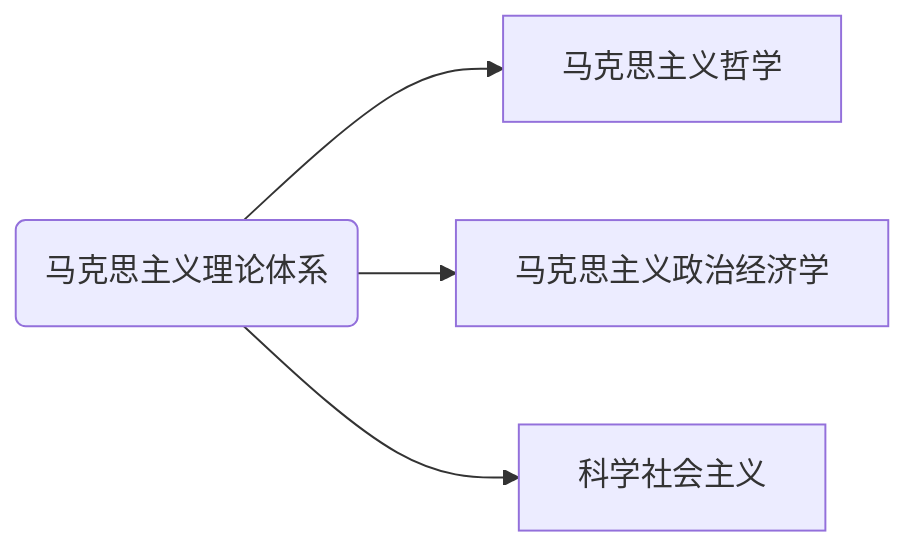
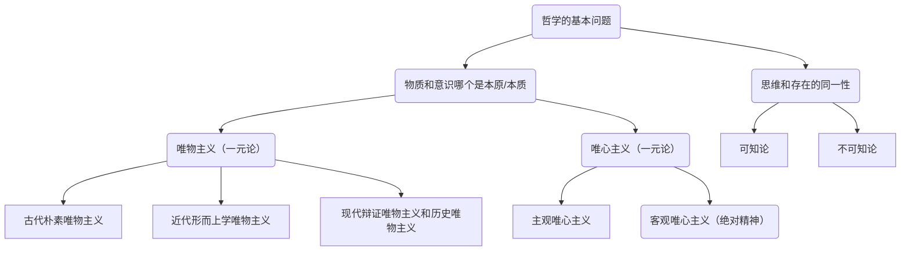

<!-- more -->






## 本博客使用插件

### 为每篇文章生成唯一链接

```bash
npm i hexo-abbrlink
```

在 `_config_yml` 中添加以下配置：

```yml blog/_config.yml
permalink: p/:abbrlink/
abbrlink: 
  alg: crc32  #算法： crc16(default) and crc32
  rep: hex    #进制： dec(default) and hex
```

### RSS 订阅

```bash
npm i hexo-generator-feed
```

在 `_config_yml` 中添加以下配置：

```yml blog/_config.yml
feed:
  type: atom
  path: atom.xml
  limit: 20
  hub:
  content:
  content_limit: 140
  content_limit_delim: ' '
  order_by: -date
  icon: icon.png
  autodiscovery: true
  template:
```

### mermaid 支持

```bash
npm i hexo-filter-kroki
```

### Github Action 自动部署日期更新问题

```bash
npm i hexo-filter-date-from-git
```

自动部署脚本设置 `fetch-depth: 0` 检出 Git 全部提交记录。

```yml .github/workflows/deploy.yml
- name: Checkout Repository main branch
  uses: actions/checkout@v3
  with:
    submodules: true # Checkout private submodules(themes or something else)
    fetch-depth: 0
```
