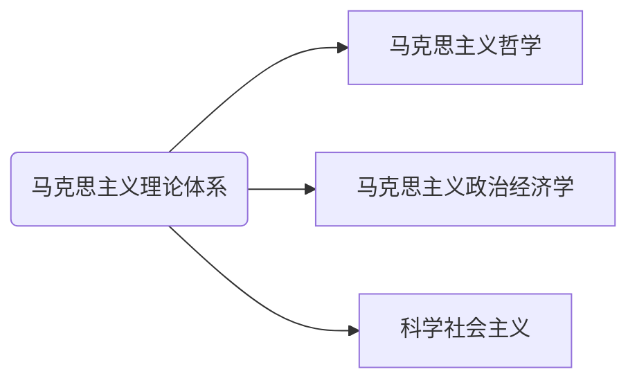
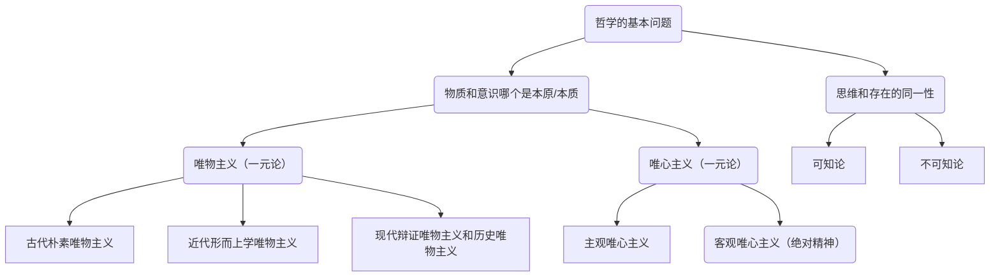

<!-- more -->

```mermaid
graph LR

q(马克思主义理论体系) --> 马克思主义哲学
q --> 马克思主义政治经济学
q --> 科学社会主义
```

```mermaid
flowchart

q(哲学的基本问题) --> a1(物质和意识哪个是本原/本质)
q --> a2(思维和存在的同一性)
a1 --> b1(唯物主义（一元论）)
a1 --> b2(唯心主义（一元论）)
a2 --> 可知论
a2 --> 不可知论

b1 --> 古代朴素唯物主义
b1 --> 近代形而上学唯物主义
b1 --> 现代辩证唯物主义和历史唯物主义
b2 --> 主观唯心主义
b2 --> b3(客观唯心主义（绝对精神）)

```

插件

hexo-abbrlink 唯一链接

hexo-generator-feed rss 订阅

hexo-filter-kroki mermaid 图片