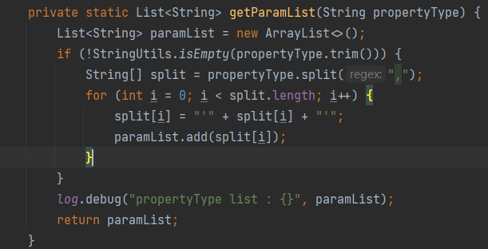
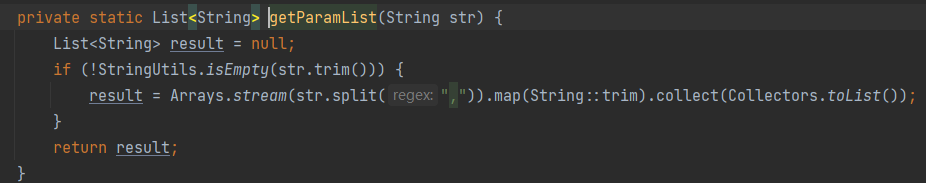

整理一波 MP 使用的一些错误点。

<!-- more -->

## 系统报错

### 错误一：Result Maps collection does not contain value for ……

在 SQL 文件中如果使用 `resultType="java.util.map"`，并且使用不止一处的话，那么凡是使用 `resultType` 或者使用 `resultMap` 这种属性的标签，不能有属性指向错误，否则就会报错： “Result Maps collection does not contain value for ……”

### 错误二：Parameter index out of range (2 > number of parameters, which is 1).

尽量不要在 mybatis 的 `sql.xml` 中的 sql 标签中注释 sql 语句，如果注释的语句中 ，那么就会报这个错误。所以如果有想要注释的语句，尽量在 mybatis 标签外面使用`<!-- 注释 sql 内容 -->` 注释。

## 手写SQL错误

### foreach标签

具体语句省略，请注意筛选条件。

```xml
select * from user c
left join address s on c.address = s.site
where s.longitude = #{longitude} and s.latitude = #{latitude}
<if test="mallId != null and mallId != ''">
    and c.mallId = #{mallId}
</if>
<if test="propertyType != null and propertyType.size() > 0">
    and c.XF_PROOFHOUSESUSE in
    <foreach collection="propertyType" index="index" item="type" open="(" separator="," close=")">
        ${type}
    </foreach>
</if>
```

上面使用了 `${}`，当我把它改为 `#{}` 时，输入筛选的条件选项都不会生效，而且没有返回数据。



之后看了看它传的参数，发现接口接收的字符串，然后在业务层转为字符串集合，并且为每个元素加入单引号后传入 SQL 的。



可能就是这个原因导致条件不生效，于是我把这段代码改成了下面的样子：



这段代码没有给分割后的字符加入英文单引号，map 对每一个元素都去掉前后的空格（请结合自身业务场景确定参数是否可包含空格，浪子这里不需要），然后再次测试该接口，perfect！it is working now!

后来又使用 `${}` 去测试，发现修改后的代码又不生效了。。。

于是我就明白了：使用 `${}` 时，参数为 List 类型需要我们手动为每个元素加入单引号，使用单引号包裹才会生效；而使用 `#{}` 类型时参数为 List 类型则不需要加入英文单引号。

### 接口传参报错

错误信息：
```bash
No primary or default constructor found for interface java.util.List]
```

前端传参都是通过数组的形式传递多个参数值，所以 controller 接口直接使用 `List<String>` 会报错，需要添加 `@RequestParam`  才能接收，或者直接使用 `String[]` 类型接收。当然也是可以使用 `@RequestBody` 的，这种情况浪子没有测试过，理论上是行的通的，如果不行就把 `List<String>` 封装到接收的对象参数中。

```java
// 方式一
public Page list(@RequestParam(value = "params", required = false) List<String> params,
                 Object obj) {
  return null;
}
// 方式二
public Page list(String[] params, Object obj) {
  return null;
}
```
