RabbitMQ是轻量级的，在AMQP（Advanced Message Queuing Protocol ）基础上实现的，易于在本地和云中部署。它支持多种消息传递协议。RabbitMQ 可以部署在分布式和联合配置中，以满足高规模、高可用性的需求。

<!-- more -->

<!-- @import "[TOC]" {cmd="toc" depthFrom=1 depthTo=4 orderedList=false}-->

<!-- code_chunk_output -->

- [一、介绍](#一介绍)
  - [1. RabbitMQ的几种模型](#1-rabbitmq的几种模型)
- [二、操作](#二操作)
  - [RabbitMQ的常用命令](#rabbitmq的常用命令)
  - [镜像队列：（使用最多）](#镜像队列使用最多)

<!-- /code_chunk_output -->、

## 一、介绍

RabbitMQ 在许多操作系统和云环境上运行，并为大多数流行语言提供了广泛的开发人员工具。比如提供了 Java、Spring Framework、.NET、Ruby、Python、PHP、JS、GO等语言的客户端、适配器和工具。



### 1. RabbitMQ的几种模型

```mermaid
graph LR
%% 最简单的模型
    subgraph 简单模型
    producer((P)) --> queue[[消息队列]] --> consumer((C))
    end

%% 工作队列:在工作者之间分配任务（竞争使用者模式)
    subgraph 工作队列
    producer2((P)) --> 
    queue2[[消息队列]] --> consumer2-1((C1))
    queue2[[消息队列]] --> consumer2-2((C2))
    end

%% 发布订阅:一次向多个消费者发送消息
    subgraph 发布/订阅
    producer3((P)) --> exchange3((X))
    exchange3 --> queue3-1[[消息队列]] --> consumer3-1((C1))
    exchange3 --> queue3-2[[消息队列]] --> consumer3-2((C2))
    end

%% 路由:有选择地接收消息
    subgraph 路由
    producer4((P)) --> exchange4((X))
    exchange4 --error--> queue4-1[[消息队列]] --> consumer4-1((C1))
    exchange4 --info--> queue4-2[[消息队列]] --> consumer4-2((C2))
    exchange4 --error--> queue4-2[[消息队列]] 
    exchange4 --warning--> queue4-2[[消息队列]] 
    end

%% 主题:基于模式接收消息（主题）
    subgraph 主题
    producer5((P)) --> exchange5((X))
    exchange5 --*.exchange--> queue5-1[[消息队列]] --> consumer5-1((C1))
    exchange5 --> queue5-2[[消息队列]] --> consumer5-2((C2))
    exchange5 --*.type1--> queue5-2[[消息队列]]
    exchange5 --*.ly--> queue5-2[[消息队列]]
    end

%% RPC
    subgraph RPC
    producer6((P)) --> exchange6-1[request] --> queue6-1[[消息队列]] --> consumer6((C))
    --> queue6-2[[消息队列]] --> exchange6-2[replay] --> producer6
    end
```



## 二、操作

### RabbitMQ的常用命令

```bash
rabbitmqctl list_users    # 查看用户列表
rabbitmqctl add_user admin 123456  #添加用户名和密码
rabbitmqctl set_permissions -p /admin".*" ".*" ".*" #修改权限
rabbitmqctl set_user_tags admin administrator  #添加用户角色


#守护模式启动（后台运行）
rabbitmq-server -detached
# 停止服务
rabbitmqctl stop
# 查看状态
rabbitmqctl status 
# 重启 rabbitmq 服务
rabbitmq-server restart
```

启用插件的同时并启动服务：`rabbitmq-plugins enable rabbitmq_management`，这个插件是 RabbitMQ 自带的，便于我们查看系统的状态数据，启用这个插件之后才可以使用 `http://IP地址:15672` 访问网页管理页面，查看具体信息。默认登录的初始账号密码为 `guest`。

> **注意：** 在较新的版本中，默认的账号只能以本地 `localhost` 的方式访问，如果服务在远程启动，本地进行远程访问操作时登录可能会出现 `User can only log in via localhost` 的情况，解决办法就是新添加一个超级管理员账户，使用这个新添加的账户登录。
> 5672 用于客户端使用，15672 用于网页控制。

### 镜像队列：（使用最多）

```bash
# 策略说明
rabbitmqctl set_policy [-p <vhost>] [--priority <priority>] [--apply-to <apply-to>] <name> <pattern> <definition>
# 查看当前策略：
rabbitmqctl list_policies
# 删除队列：
rabbitmqctl clear_policy ha-all
```

1. -p vhost 可选参数，针对指定 vhost 下的 queue 进行设置
    name: policy 的名称
    pattern: queue 的匹配模式（正则表达式）
    definition: 镜像定义，包括三个部分ha-mode、ha-params、ha-sync-mode
2. ha-mode 指明镜像队列的模式，有效值 all/exactly/nodes
all 表示在集群所有的节点上进行镜像
exactly 表示在指定个数的节点上进行镜像，节点的个数由 ha-params 指定
nodes 表示在指定的节点上进行镜像，节点名通过 ha-params 指定

3. ha-params: ha-mode 模式需要用到的参数
ha-sync-mode: 进行队列中消息的同步方式，有效值为 automatic 和 manual
priority: 可选参数，policy 的优先级。
