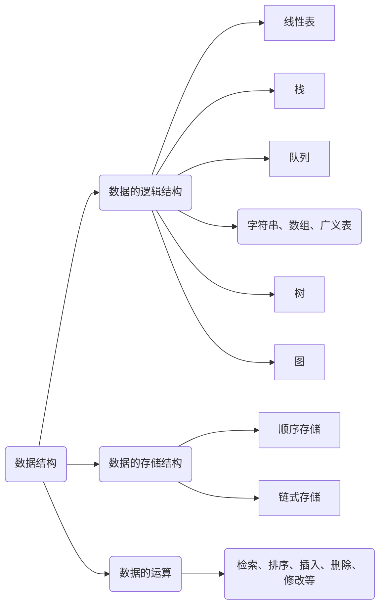
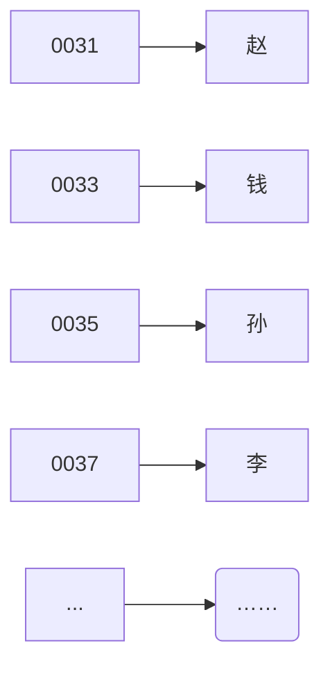
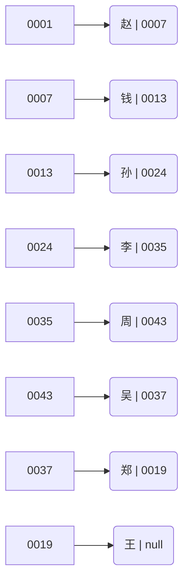
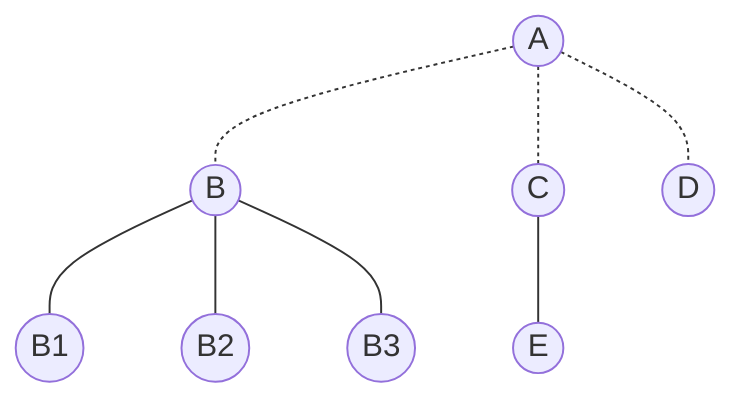
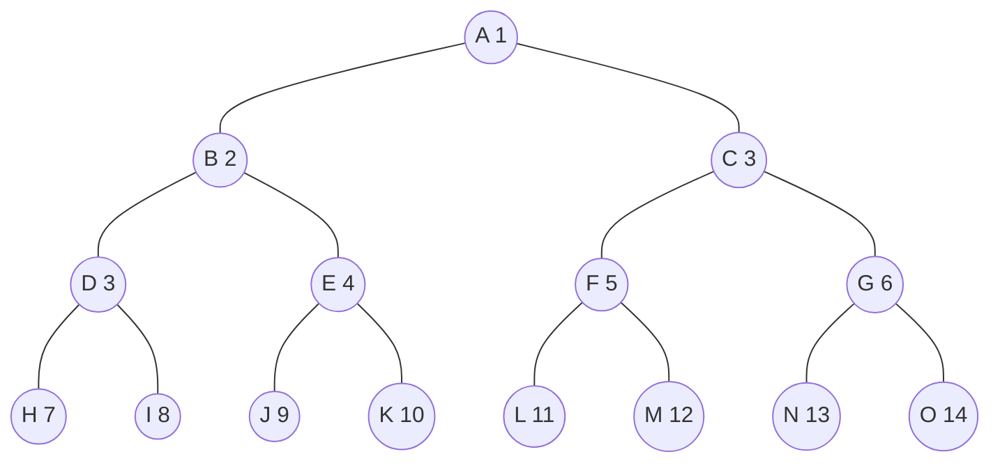

对于数据结构的理解和学习，浪子建议扔掉自己掌握的语言的相关实现。所谓数据结构，是一种抽象化的存储数据的结构，它是一种抽象的概念，数据结构最最重要的是它的特性，特性决定了我们在开发中的选择，进而影响程序的运行效率和占用空间。学好数据结构的相关知识，开发中在合适的地方采用合适数据结构，能够让我们的程序更好的运行。

<!-- more -->

<!-- @import "[TOC]" {cmd="toc" depthFrom=2 depthTo=4 orderedList=false} -->

<!-- code_chunk_output -->

- [一、 线性表](#一-线性表)
  - [顺序表](#顺序表)
    - [特点（随机存取）](#特点随机存取)
    - [顺序表优缺点](#顺序表优缺点)
  - [链表](#链表)
    - [特点（顺序存取）](#特点顺序存取)
    - [链表优缺点](#链表优缺点)
- [二、了解数据结构:链表](#二了解数据结构链表)
  - [2.1 单链表](#21-单链表)
  - [2.2 双链表](#22-双链表)
  - [2.3 循环链表](#23-循环链表)
- [三、栈](#三栈)
- [四、队列](#四队列)
- [五、字符串、数组、广义表](#五字符串数组广义表)
- [六、树](#六树)
- [七、二叉树](#七二叉树)
  - [7.1 二叉树性质](#71-二叉树性质)
  - [7.2 两种特殊的二叉树](#72-两种特殊的二叉树)
    - [（1） 满二叉树](#1-满二叉树)
    - [（2） 完全二叉树](#2-完全二叉树)
      - [完全二叉树的性质](#完全二叉树的性质)
  - [7.3 二叉树的存储结构](#73-二叉树的存储结构)
  - [7.4 二叉树遍历方式](#74-二叉树遍历方式)
- [八、树和森林](#八树和森林)
  - [8.1 树与二叉树的转换](#81-树与二叉树的转换)
    - [将树转换成二叉树](#将树转换成二叉树)
    - [将二叉树转换成树](#将二叉树转换成树)
  - [8.2 森林与二叉树的转换](#82-森林与二叉树的转换)
    - [森林转为二叉树](#森林转为二叉树)
    - [二叉树转为森林](#二叉树转为森林)
  - [8.3 树的遍历](#83-树的遍历)
  - [8.4 森林遍历](#84-森林遍历)
  - [8.5 哈夫曼树（最优二叉树）](#85-哈夫曼树最优二叉树)
- [九、图](#九图)

<!-- /code_chunk_output -->



数据结构可以简单分为两大类：线性表，非线性表。

## 一、 线性表

线性表是具有相同特性的数据元素的一个有限序列。
($a_1$, $a_2$, $a_3$, $a_4$, ..., $a_n$)
n = 0 时为空表。

同一线性表中的元素必定具有 **相同特性**（编程语言中可视为同种数据类型），数据元素间的关系是线性关系。

特征：

- 在非空的线性表中，有且仅有一个开始结点 $a_1$，它没有直接前驱，而是仅有一个直接后继 $a_2$；
- 有且仅有一个终端结点 $a_n$，他没有直接的后继，而仅有一个直接前驱 $a_n~\_~_1$；
- 其余的内部结点 $a_i$ $(2<=i<=n-1)$ 都有且仅有一个直接前驱 $a_i~\_~_1$ 和一个直接后继 $a_i~_+~_1$。

### 顺序表

线性表采用 **顺序存储** 结构存储数据时称为 **顺序表**。

#### 特点（随机存取）

以 **物理位置相邻** 表示逻辑关系。

#### 顺序表优缺点

- 优点：1. 存储密度大；2. 可以随机存取表中任一元素。
- 缺点：1. 插入、删除时，需要移动大量元素；2. 浪费存储空间；静态存储形式，数据元素的个数不能自由扩充。

### 链表

线性表采用 **链式存储** 结构存储数据时称为 **链表**。链表分为单向链表，双链表，循环链表。

#### 特点（顺序存取）

1. 结点在存储器中是任意的，即逻辑上相邻的数据在物理上不一定相邻。
2. 访问时只能通过头指针进入链表，并通过每个结点的指针域依次向后顺序扫描其余结点，所以寻找第一个和最后一个结点所花费的时间不等。

#### 链表优缺点

优点：逻辑上连续，物理上未必连续存储。有效利用碎片空间。插入、删除的效率高。
缺点：随机查找元素时效率不高，需要从头遍历所有元素。

## 二、了解数据结构:链表

|术语名称|含义|
|--|--|
|数据域|存储元素数值数据。|
|指针域|存储直接后继结点的存储位置。|
|结点  |数据元素的存储映像，由数据域和指针域两部分组成。|
|首元结点|链表中存储第一个数据元素的结点|
|头指针|指向链表中第一个结点的指针|
|头结点|链表的首元结点之前 **附设** 的一个结点。（处理方便）|

> 链表分为 **带头结点** 的链表和 **不带头结点** 的链表。

> **加了头结点有什么好处？**
> 1. 如果加了头结点，便于首元结点的处理。首元结点的地址保存在头结点的指针域中，所以在链表的第一个位置上的操作和其它操作一致，无须进行特殊处理。
> 2. 空表的表示和非空表也一样。
>
> **头结点的数据域内存储的什么？**
> 1. 头结点的数据域可以为空，也可以存放线性表长度等附加信息，但此结点不能计入链表长度值。

比如给出一组线性表数据：（赵，钱，孙，李，周，吴，郑，王）
顺序表表示(内存地址递增，连续空间)：



链表表示（每个结点出了数据还包括一个指向下一个结点指针域）



### 2.1 单链表

单链表：结点只有一个指针域的链表；指针域指向后继结点。

### 2.2 双链表

双链表：结点有两个指针域的链表，在单链表的每个结点再增加一个指向其前驱结点的指针域。

### 2.3 循环链表

首尾相接的链表称之为循环链表。从表中任一结点出发都可以找到表中的其它结点。

单向循环链表：是一种首尾相连的链表，在单链表中的尾结点的指针域指向头结点，整个链表形成一个环。

双向循环链表：在双向链表的尾结点的尾指针域指向头结点的头指针。

## 三、栈

只能在线性表的一端进行操作（添加/删除等），一般是在栈顶（线性表尾部）。

## 四、队列

在线性表的端点进行操作，一般是在队首删除，队尾插入。

## 五、字符串、数组、广义表

前两种略过，只讲广义表。

广义表（又称为列表），是 $n >= 0$ 个元素 $a_0, a_1, a_2, ..., a_n~\_~_1$ 的有限序列，其中每一个 $a_i$ 或者是原子，或者是一个广义表。
广义表通常记作：$LS = (a_1, a_2, ..., a_n)$，习惯上，一般以 **大写字母** 表示广义表，**小写字母** 表示原子。

表头：若 LS 非空(n >= 1)，则其 **第一个** 元素就是表头，记作 head(LS) = $a_1$。
表尾：除表头以外的子表，记作 tail(LS) = $(a_2, a_3, ..., a_n)$。
> **注意：**
> 表头可以是原子，也可以是子表。
> 表尾不是一个元素，而是一个子表。表尾一定是一个表。

|表|举例|
|--|--|
|$A()$|空表，长度为 0
|$B(())$|长度为 1，表头、表尾均为 ()
|$C(a, (b, c))$|长度为 2，由原子 a 和子表 (b, c) 构成，表头：a，表尾：((b, c))。
|$D(x, y, z)$|长度为 3，每一项都为原子，表头为 x，表尾为 (y, z)
|$E(C, D)$|长度为 2，表头为 C，表尾为 (D)
|$F(a, F)$|递归/嵌套广义表，长度为 2，第一项为 a，第二项为它本身。表头为 a，表尾为 (F)。 $F = (a, (a, (...)))$。

广义表的性质

1. 广义表中的数据元素有相对次序，一个直接前驱和一个直接后继。
2. 广义表的长度定义为最外层所包含的元素个数。如 $C=(a, (b, c))$ 是长度为 2 的广义表。
3. 广义表的深度定义为该广义表展开后所含括号的层数；$A = (b, c)$ 的深度为 1，$B = (A, d)$ 的深度为 2，$C = (f, B, h)$ 的深度为 3。**注意：** 原子的深度为 **0**，“空表”的深度为 1。
4. 广义表可以和其它广义表共享。比如 $A = (b, c)$，$B = (A, d)$，表 B 就共享了表 A。
5. 广义表可以是一个递归的表，比如：$F = (a, (a, (...)))$。**递归表的深度是无穷的，但长度是有限的**。
6. 广义表是多层次的结构，广义表的元素可以是单元素，也可以是子表，而子表的元素还可以是子表，...。
   例：$D = (E, F), E = (a, (b, c)), F = (d, (e))$
   图形表示(方框代表 **原子**，圆圈代表 **子表**)：

   ```mermaid
   graph TB
   root((D)) --> s1((E))
   root((D)) --> s2((F))
   s1 --> a
   s1 --> n1(( ))
      n1 --> b
      n1 --> c
   s2 --> d
   s2 --> n2(( ))
      n2 --> e
   ```

广义表可以看成是线性表的推广，线性表是广义表的特例。
广义表的结构相当灵活，在某种前提下，它可以兼容线性表、数组、树和有向图等各种常用的数据结构。

当二维数组的每行（或每列）作为子表处理时，二维数组即为一个广义表。
另外，树和有向图也可以用广义表来表示。
由于广义表不仅集中了线性表、数组、树和有向图等常见的数据结构的特点，而且可以有效地利用存储空间，因此在计算机的许多应用领域都有成功使用广义表的案例。

广义表的基本运算：求表头、表尾

## 六、树

树型结构是一种非线性的数据结构，结点有分支，具有一定的层次关系。

树是n(n>=0)个结点的有限集。
n=0时为空树；
n>0时，则它满足如下两个条件：

1. 有且仅有一个特定的称为根的结点；
2. 其余结点可分为 m(m>=0) 个互不相交的有限集 T1,T2...Tm，其中每一个集合本身又是一棵树，并称为根的子树（SubTree）。显然，树是一个 **递归** 的定义。


|术语名称|解释|
|--|--|
|结点|数据元素以及指向子树的分支|
|根结点|非空树中无前驱结点的结点|
|结点的度|结点拥有的子树数（子树的个数/分支数/直接后继结点数）|
|数的度|树内各结点的度的最大值|
|叶子结点/终端结点|度=0|
|分支结点/非终端结点|度 != 0|
|内部结点|不是根结点和叶子结点的其它结点|
|兄弟结点|拥有共同双亲结点的结点|
|树的深度/高度|树中结点的最大层次|

有序树：树中结点的各子树从左到右有次序（最左边的为第一个孩子）
无序树：树中各结点无序。

森林：m（m>=0）棵互不相交的树的集合。
一棵树可以看成一个特殊的森林：把根结点删除就变成了森林；给森林中的各子树加上一个双亲结点，森林就变成了树。

例如：把下面的根结点 A 删除就成了森林，把 B、C、D 三颗树加上双亲结点 A 就成了一棵树。



> 树一定是森林，森林不一定是树。

## 七、二叉树

每个结点最多有两个孩子（二叉树中不存在度大于2的结点）
子树有左右之分，其次序不能颠倒。
二叉树可以是一个空集，根可以有空的左子树或空的右子树。

> 二叉树不是树的特殊情况，它们是两个概念。
> 二叉树必须要区分左、右子树，即便只有一棵子树也要区分。
> 树的结点只有一个孩子时，就无须区分它是左还是右的次序。这是二叉树和树的最主要的区别。
> 虽然二叉树与树概念不同，但有关书的基本术语对二叉树都适用。

为何要重点研究二叉树（每个结点最多只有两个“叉”的树）？

- 普通树如过不转为二叉树，则它的结构很复杂，运算很难实现。
- 二叉树结构最简单，规律性最强；
- 可以证明，所有的树都能转化为唯一对应的二叉树，不失一般性。

二叉树在树结构的应用中起着非常重要的作用，因为对二叉树的许多操作算法简单，而任何树都可以和二叉树相互转换，这样就解决了树的存储结构及其运算中存在的复杂性。

### 7.1 二叉树性质

1. 在二叉树的第 i 层上至多有 $2^i~^-~^1$ 个结点（i >= 1）;第i层上至少有 1 的结点。
2. 深度为 k 的二叉树至多有 $2^k$ - 1 个结点(k >= 1)。至少有 k 个结点。
3. 对任何一颗二叉树 $T$，如果其叶子数为 $n_0$ ,度为2的节点数为 $n_2$，则 $n_0$ = $n_2$ + 1

性质 4、5 需要先学习两种特殊的二叉树。

### 7.2 两种特殊的二叉树

#### （1） 满二叉树

定义：深度为k且有 $2^k$ - 1 个结点的二叉树（可以视为性质 2 特例）。

特点
每层上的结点数都是最大结点数（每层都满）。
叶子结点全部在最底层。
对满二叉树结点位置进行编号，编号规则：

- 自根结点开始，自上而下，从左至右。
- 每一个结点位置都有元素。



满二叉树在同样深度的二叉树中 **结点** 个数最多
满二叉树在同样深度的二叉树中 **叶子结点** 个数最多

#### （2） 完全二叉树

定义：深度为 k 的具有 n 个结点的二叉树，当且仅当其每一个结点都与深度为 k 的满二叉树中编号为 1~n 的结点一一对应时，称为完全二叉树。

从满二叉树中从最后一个结点开始，**连续** 的去掉任意个结点，即是一个完全二叉树。
> 满二叉树一定是完全二叉树，完全二叉树不一定是满二叉树。

特点：
叶子结点只可能分布在层次最大的两层上
对任一结点，如果其右子树的最大层次为 i，则其左子树的最大层次必为 i 或 i+1。


##### 完全二叉树的性质

1. 具有 n 个结点的完全二叉树的深度为 $log_2n + 1$。
2. 如果对一棵树有 n 个结点的完全二叉树，深度为 $log_2n + 1$ 的结点按层序编号（从第一层到第 $log_2n + 1$ 层，每层从左到右），则对任一结点i（1<= i <=n），有：
   1）如果 i = 1，则结点 i 是二叉树的根，无双亲；如果 i > 1，则其双亲是结点 i/2;
   2）如果 2i > n，则结点 i 为叶子结点，无左孩子；否则，其左孩子是结点2i；
   3）如果 2i+1 > n，则结点 i 无右孩子；否则，其右孩子是结点 2i+1。

性质 4 表明了完全二叉树 **结点数 n** 与完全二叉树 **深度 k** 之间的关系。
性质 5 表明了完全二叉树中 **双亲结点** 编号与 **孩子结点** 编号之间的关系。

### 7.3 二叉树的存储结构

二叉树的顺序存储：按满二叉树的结点层次编号，依次存放二叉树中的数据元素。（使用数组放在对应的下标位置）


如果该二叉树不是一棵完全二叉树，那么还是按照这个方法，在没有元素的位置存储 **空** 或者 **0**。这样保证了数据能够恢复。

顺序存储的缺点：定长；如果空数据较多，浪费空间。
顺序存储适于存储满二叉树和完全二叉树。

二叉树的链式存储：一个结点包括三个要素，一个数据域和两个指针域，一个指针指向左孩子，一个指针指向右孩子。


在结点数为 n 的二叉链表中，空指针域有 n+1 个。

> 三叉链表：在二叉链表的基础上增加一个指向双亲的指针域，由一个数据域和三个指针域构成。

### 7.4 二叉树遍历方式

先序遍历DLR：访问根结点D，先序遍历左子树L，先序遍历右子树R
中序遍历LDR：中序遍历左子树L，访问根D，中序遍历右子树R
后序遍历LRD：后序遍历左子树L，后序遍历右子树R，访问根D
二叉树的层次遍历：从根结点开始按从上到下、从左到右的顺序去遍历，每个结点仅访问一次。


如果同时确定了先序、中序序列或者同时确立了后序、中序序列，那么就可以 **唯一的确定** 这棵二叉树结构。

线索二叉树（基于链式二叉树）：
如果某个结点的左孩子为空，则将空的左孩子指针域改为指向其前驱；
如果某个结点的右孩子为空，则将空的右孩子指针域改为指向其后继。
这种改变指向的指针称为“线索”。加上了线索的二叉树称为线索二叉树。

在线索二叉树中，为了区分指针域是指向前驱还是后继，在结点中又添加了两个标记域 ltag、rtag，值为 1 代表指针域指向前驱；值为 0 代表指向后继。

## 八、树和森林

树的双亲表示法，定义结构数组，存放树的结点，每个结点含两个域：**数据域** 存放结点本身信息，**双亲域** 指示本结点的双亲在数组中的位置。

特点：找双亲容易，找孩子难。

孩子链表：
把每个结点的孩子结点排列起来，看成是一个线性表，用单链表存储。


特点：找孩子容易，找双亲难。

把两种方法结合，在数据的前面加入一个域存储双亲的位置下标。称为带双亲的孩子链表。


孩子兄弟表示法（二叉树表示法，二叉链表表示法）
实现：用二叉链表作树的存储结构，链表中的每个结点的两个指针域。分别指向其第一个孩子结点和下一个兄弟结点。


特点：找孩子、兄弟容易，找双亲难。

### 8.1 树与二叉树的转换

将树转换为二叉树：
由于树和二叉树都可以用 **二叉链表** 作存储结构，则以二叉链表为媒介可以导出树与二叉树之间的一个对应关系。

给定一棵树，可以找到唯一的一棵二叉树与之对应。如下图（最右边为转换后的二叉树）


#### 将树转换成二叉树


1、加线：在兄弟之间加一连线；
2、抹线：对每个结点，除了其左孩子之外，去除其与其余孩子之间的关系；
3、旋转：以树的根结点为轴心，将其整树顺时针旋转45°。

树变二叉树口诀：兄弟相连留长子。

#### 将二叉树转换成树


1、加线：若 p 结点是双亲孩子的左孩子，则将 p 的右孩子，右孩子的右孩子……沿分支找到的所有右孩子，都与 p 的双亲用线连起来；
2、抹线：抹掉原二叉树中双亲与右孩子之间的连线；
3、调整：将结点按层次排列，形成树结构。
二叉树变树口诀：左孩右右连双亲，去掉原来右孩线。

### 8.2 森林与二叉树的转换

#### 森林转为二叉树


1、将各棵树分别转换成二叉树；
2、将每棵树的根结点用线相连；
3、以第一棵树根结点为二叉树的根，再以根结点为轴心，顺时针旋转，构成二叉树型结构。

森林变二叉树口诀：树变二叉根相连。

#### 二叉树转为森林


1、抹线：将二叉树中根结点与其右孩子连线，及沿右分支搜索到的所有右孩子间连线全部抹掉，使之变成孤立的二叉树；
2、还原：将孤立的二叉树还原成树。

二叉树变森林口诀：去掉全部右孩线，孤立二叉再还原。

### 8.3 树的遍历

先根遍历：先访问根结点，然后依次先跟遍历各子树。
后根遍历：先依次后根遍历各棵子树，然后访问根结点。
层次遍历：自上而下自左至右访问树中每个结点。

### 8.4 森林遍历

将森林看作由三部分构成：
1、森林中第一棵树的根结点；
2、森林中第一棵树的子树森林；
3、森林中其它树构成的森林。

先序遍历：
1、访问森林中的第一棵树的根结点；
2、先序遍历森林中的第一棵树的子树森林；
3、先序遍历森林中（除第一棵树外）其余树构成的树林。
即：依次从左至右对森林中的每一棵树进行先根遍历。

中序遍历：
1、中序遍历森林中的第一棵树的子树森林；
2、访问森林中的第一棵树的根结点；
3、中序遍历森林中（除第一棵树外）其余树构成的树林。
即：依次从左至右对森林中的每一棵树进行后根遍历。

后序遍历：

### 8.5 哈夫曼树（最优二叉树）

路径：从树种一个结点到另一个结点之间的分支构成两个结点间的路径。
结点的路径长度：两个结点间路径上的分支数。
树的路径长度：从树根到每一个结点的路径长度之和。记作 TL。
权：将树中结点赋给一个有着某种含义的数值，则这个数值称为该结点的权。
结点的带权路径长度：从根结点到该结点之间的 **路径长度** 与该结点的权的乘积。
树的带权路径长度：树中所有叶子结点的带权路径长度之和。

哈夫曼树：最优树 就是带权路径长度最短的树。注意：带权路径长度最短是在 “度相同” 的树中比较而得的结果，因此有最优二叉树、最优三叉树之称等等。

哈夫曼树：最优二叉树，带权路径长度最短的二叉树

相应的算法（构造哈夫曼树的方法）称为哈夫曼算法。

满二叉树不一定是哈夫曼树；具有相同带权路径长度的哈夫曼树不唯一。
哈夫曼树中权越大的叶子离根越远。

哈夫曼树的结点的度数为0或2，没有度为1的结点。
包含n个叶子结点的哈夫曼树中共有 2n-1 个结点。 
包含 n 棵树的森林要经过 n-1 次合并才能形成哈夫曼树，共产生 n-1 个新结点。

哈夫曼树中共有 2n-1 个结点，且其所有分支结点的度都不为1。

> 结点数目相同的二叉树中，完全二叉树是路径长度最短的二叉树。

## 九、图

G=(V,E)
V：顶点的有穷非空集合
E：边的又穷集合

有向图：每条边都有方向
无向图：每条边都没有方向
完全图：任意连个点都有一条边相连。
n 个顶点，n(n-1)/2 条边。
稀疏图：有很少边或弧的图（e < nlogn)
稠密图：有很多边或弧的图
网：边/弧带权的图
邻接：有边/弧相连的两个顶点之间的关系
关联（依附）：边/弧与顶点之间的关系
顶点的度：与该顶点相关联的边的数目
在有向图中，顶点的度等于该顶点的入度和出度

路径：接续的边构成的顶点序列
路径长度：路径上边/弧的数目/权值之和
环：第一个顶点和最后一个顶点相同的路径
简单路径：除路径的起点和终点相同，其余顶点都不相同的路径

连通图（强连通图）
在无（有）向图 G=(V, {E}) 中，若对任意两个顶点v、u都存在从 v 到 u 的路径，则称 G 是连通图（强连通图）。

权与网
图中边或弧所具有的相关数称为权。表明一个顶点到另一个顶点的距离或耗费。
带权的图称为网
子图：设有两个图 G=(V, {E}), G1=(V1, {E1})，若 V1 V, E1 E，则 G1 是 G 的子图。
连通分量：无向图G的极大连通子图称为G的连通分量

极大连通图的意思是：该子图是 G 连通子图，将 G 的任何不在该子图中的顶点加入，子图不在连通。

有向图G的极大连通子图称为G的强连通分量

极小连通子图：该子图是G的连通子图，在该子图中删除任何一条边，子图不再连通。
生成树：包含无向图G所有顶点的极小连通子图
生成森林：对非连通图，由各个连通分量的生成树的集合

> 本笔记只记录了一些图的术语，没有其他讲解。图的应用是非常多的，尤其是在关系模型中，体现尤为明显。
> **注：**
> 本文截图来源于 B 站视频《数据结构与算法基础（青岛大学-王卓）》视频中的内容，由 87师兄 分享。
> 视频地址：https://www.bilibili.com/video/BV1nJ411V7bd
