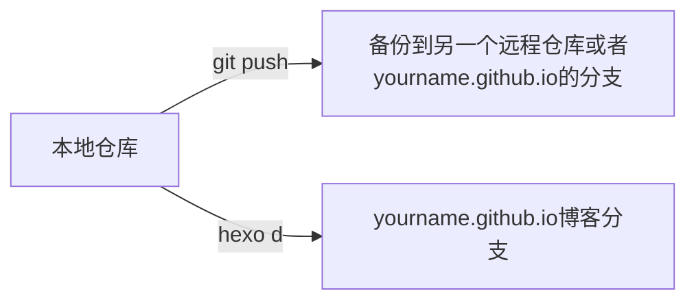
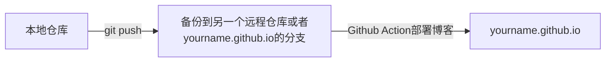

使用 Github Pages 服务和 Hexo 搭建的个人静态博客网站，集成 Github Action 完成自动部署。

<!-- more -->

## 一、什么是[Github Action](https://docs.github.com/cn/actions/learn-github-actions/understanding-github-actions)

GitHub Actions 是一个持续集成和持续交付 (CI/CD) 平台，可用于自动执行构建、测试和部署管道。可以创建工作流程来构建和测试存储库的每个拉取请求，或将合并的拉取请求部署到生产环境。

GitHub Actions 不仅仅是 DevOps，还允许您在存储库中发生其他事件时运行工作流程。例如，您可以运行工作流程，以便在有人在您的存储库中创建新问题时自动添加相应的标签。

GitHub 提供 Linux、Windows 和 macOS 虚拟机来运行工作流程，或者您可以在自己的数据中心或云基础架构中托管自己的自托管运行器。

## 二、Hexo博客集成Github Action

使用过 Github Pages 和 Hexo 服务的少侠都知道，在我们写完文章的时候，都会执行 `hexo cl && hexo g && hexo d` 这几条命令去部署自己的博客。如果是喜欢 **备份** 的的小伙伴，可能会在带有 Github Pages 服务的的仓库（yourname.github.io）使用另一个分支去存储备份；或者直接使用了两个仓库：一个存储 Hexo 博客文件备份，另一个存储Github Pages服务需要的HTML、CSS、JS等静态文件。
这时当我们写完文章后，使用推送命令 `git add . && git commit -m "add/update" && git push` 把文件提交到备份库，然后再去部署到 Pages 服务的分支或者仓库。

<!-- T-上，B\D-下；L-左，R-右 -->


从上面介绍来看，需要备份文件的Hexo博客，每次都需要经过两个步骤：

1. 备份写好的文件
2. Pages仓库部署静态文件

那么能不能简化成为一步呢？答案是肯定的，CI/CD 在日常的项目中已经是很常见的了，接下来我们使用 Github Action 来帮助我们完成自动部署。这样我们自己只需要在本地写好文章，然后推送到远程仓库，至于后面的 `hexo cl && hexo g && hexo d` 这几个命令就交给 Action 去自动完成。



当然，有的少侠喜欢写完直接部署，隔一段时间才进行备份文件的推送，亦或者不需要文件/主题配置的备份，可能觉得这样做没必要（浪子以前就是）。这个看少侠自己的情况了，如果想把玩把玩Github Action，可以当作 CI/CD 的入门案例。

## 三、开始

### 1. SSH密钥配置

SSH 密钥的作用我想大家都了解了，这里配置这个密钥是两个仓库或者两个分支去通信的凭证。举个栗子，Pages服务是单独一个仓库，而我的备份文件在一个私有库中(一般备份不想让他人可见)，我在我的私有库中使用了Github Action，把自己的内容去部署发布到 Pages 仓库。这样需要一个身份的验证，如果是 Pages 仓库的不同分支也是同理。
这样我想大家就理解了，下面的内容就是生成一个 SSH 密钥对，把公钥放在 Pages 服务仓库的变量里，把 **私钥** 放在 **备份仓库** 的变量里，之后在 Action 的 **yml** 文件中去使用，这样就不会出错了。

#### 1. 创建新的SSH密钥

`ssh-keygen -t rsa -C 'xxx@xx.com' -f ~/.ssh/action_rsa`，创建完成后会在 `~/.ssh/` 路径下生成两个文件：**action_rsa** 和 **action_rsa.pub**

#### 2. 设置密钥

##### 2.1 Github Pages服务同一个仓库的新分支存放备份

在 `yourname.github.io` 仓库，依次点击 settings -> Deploy keys -> Add deploy key。

1. title随便填写，记着就行，后面编写脚本需要用到；
2. key填写上面生成的 `action_rsa.pub` 公钥的全部内容；
3. Allow write access 选项打勾。


然后还是在仓库的 settings 页面，点击 `Deploy keys` 下面的 `Secrets` 选项，选择 `Actions`，新建一个 secret：

1. Name 随便填写，后面编写脚本需要用到；
2. Value 填写 `action_rsa` 私钥的全部内容。


##### 2.2 新仓库存放备份

如果 Github Pages 个人博客和 Hexo 备份文件是在两个不同的仓库中，密钥的配置和上面类似。不同之处在于 `action_rsa` 私钥需要配置在 Hexo 备份仓库里。其它的步骤都和 2.1 一样。

至此，密钥的配置结束。

### 2. Action脚本

Github Action 的脚本文件是在 `.github/workflows/xxx.yml` 路径下，是 `yml` 格式的。我们可以使用别人已经写好的脚本，也可以全部自己编写。

需要注意的是，如果你使用的 Hexo 主题中有自定义标签，并且在 markdown 文件中有所使用的话，在 Github Action 自动部署的时候会发生解析错误，找不到自定义标签的解析内容，这点需要注意。解决的办法有多种，可以在脚本中添加使用的主题，每次部署的时候去获取，或者在 Hexo 仓库中使用 `git submodule add origin https://github.com/xxxx/ themes/xxx` 的方式去添加主题，在 **yml** 文件中使用 `submodules: true` 选项开启子模块检出，都是可以解决的，下面给两个示例。

以下是浪子使用的脚本示例（适用于不同仓库或者不同分支，第二个借用了他人的脚本）：

```yml{.line-numbers}
name: Hexo Blog CI

# master branch on push, auto run
on: 
  push:
    branches:
      - main
      
jobs:
  build: 
    runs-on: ubuntu-latest 
        
    steps:
    # check it to your workflow can access it
    # from: https://github.com/actions/checkout
    - name: Checkout Repository main branch
      uses: actions/checkout@main 
      with:
        submodules: true
      
    # from: https://github.com/actions/setup-node  
    - name: Setup Node.js 16.x 
      uses: actions/setup-node@master
      with:
        node-version: "16.15.0"
    
    - name: Cache node modules
      uses: actions/cache@v1    # 缓存node_modules，避免每次跑action都要重新下载
      id: cache
      with:
        path: node_modules
        key: ${{ runner.os }}-node-${{ hashFiles('**/package-lock.json') }}
        restore-keys: |
          ${{ runner.os }}-node-
    
    - name: Setup Hexo Dependencies
      run: |
        npm install hexo-cli -g
        npm install

    - name: Setup Deploy Private Key
      env:
        HEXO_DEPLOY_PRIVATE_KEY: ${{ secrets.ACCESS_TOKEN }}    # 这个就是Source仓库的私钥
      run: |
        mkdir -p ~/.ssh/
        echo "$HEXO_DEPLOY_PRIVATE_KEY" > ~/.ssh/id_rsa 
        chmod 600 ~/.ssh/id_rsa
        ssh-keyscan github.com >> ~/.ssh/known_hosts
        
    - name: Setup Git Infomation
      run: | 
        git config --global user.name "xxx"
        git config --global user.email "xxxx@qq.com"
    - name: Deploy Hexo 
      run: |
        hexo clean
        hexo generate 
        hexo deploy
```

```yml{.line-numbers}
name: CI

on: [push]

jobs:
  build:
    runs-on: ubuntu-latest
    name: A job to deploy blog.
    steps:
    - name: Checkout
      uses: actions/checkout@v1
      with:
        submodules: true # Checkout private submodules(themes or something else).
    
    # Caching dependencies to speed up workflows. (GitHub will remove any cache entries that have not been accessed in over 7 days.)
    - name: Cache node modules
      uses: actions/cache@v1
      id: cache
      with:
        path: node_modules
        key: ${{ runner.os }}-node-${{ hashFiles('**/package-lock.json') }}
        restore-keys: |
          ${{ runner.os }}-node-
    - name: Install Dependencies
      if: steps.cache.outputs.cache-hit != 'true'
      run: npm i
    
    # Deploy hexo blog website.
    - name: Deploy
      id: deploy
      # 原使用仓库：sma11black/hexo-action@v1.0.3，由于原作者的 node 环境较低，不支持浪子使用的主题，浪子对其进行了修改，上传到了自己的仓库，未发布 marketplace，该脚本遵循 MIT 协议。
      uses: jhlzlove/hexo-deploy-node16@main
      with:
        deploy_key: ${{ secrets.ACCESS_TOKEN }}  # ssh private key
        user_name: xxx  # (or delete this input setting to use bot account)
        user_email: xxxx@qq.com # (or delete this input setting to use bot account)
        commit_msg: ${{ github.event.head_commit.message }}  # (or delete this input setting to use hexo default settings)
    # Use the output from the `deploy` step(use for test action)
    - name: Get the output
      run: |
        echo "${{ steps.deploy.outputs.notify }}"
```

### 3. 测试

以上内容全部完成后，本地新建一个 md 文件后添加内容后，直接推送到远程仓库，等待一段时间，访问 `yourname.github.io` 查看是否有自己的新文章吧！还是推荐查看 Action 流程，可以查看出错原因。
