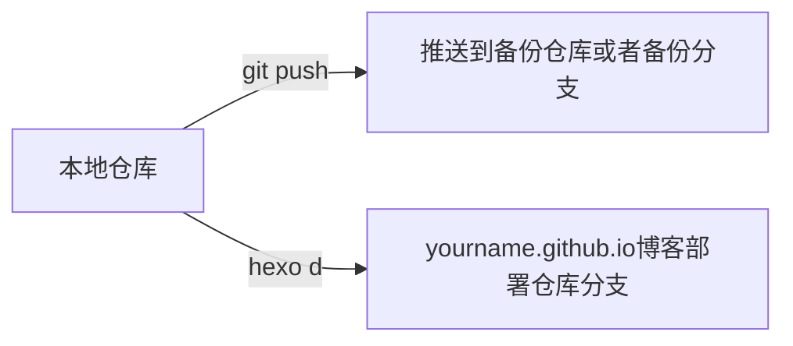
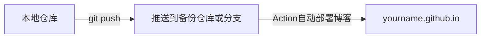

## 一、什么是[Github Action](https://docs.github.com/cn/actions/learn-github-actions/understanding-github-actions)

GitHub Actions 是一个持续集成和持续交付 (CI/CD) 平台，可用于自动执行构建、测试和部署管道。可以创建工作流程来构建和测试存储库的每个拉取请求，或将合并的拉取请求部署到生产环境。

GitHub Actions 不仅仅是 DevOps，还允许您在存储库中发生其他事件时运行工作流程。例如，您可以运行工作流程，以便在有人在您的存储库中创建新问题时自动添加相应的标签。

GitHub 提供 Linux、Windows 和 macOS 虚拟机来运行工作流程，或者您可以在自己的数据中心或云基础架构中托管自己的自托管运行器。

## 二、使用Github Action部署Hexo博客

使用过 Github Pages 和 Hexo 服务的少侠都知道，我们写完文章的时候，都会执行 `hexo cl && hexo g && hexo d` 这几条命令去发布到 Pages 仓库。
如果有 **备份** 的小伙伴们，可能会在 Pages 的仓库（yourname.github.io）使用另一个 **分支** 去存储备份；或者直接使用两个仓库：Pages 仓库和存储 Hexo 的文件备份。
这时当我们写完文章后，使用推送命令 `git add . && git commit -m "add/update" && git push` 把文件提交到备份库/分支，然后再执行 `hexo cl && hexo g && hexo d`部署到 Pages 服务的分支或者仓库。

<!-- T-上，B\D-下；L-左，R-右 -->


从上面介绍来看，需要备份文件的Hexo博客，每次都需要经过两个步骤：

1. 备份写好的文件以及主题等配置
2. Pages仓库部署静态文件

那么能不能简化成为一步呢？答案是肯定的，CI/CD 在日常的项目中已经是很常见的了，接下来我们使用 Github Action 来帮助我们完成自动部署。这样我们自己只需要在本地写好文章，然后推送到远程仓库，至于后面的 `hexo cl && hexo g && hexo d` 这几个命令就交给 Action 去帮助我们自动完成。



当然，有的少侠喜欢写完直接部署，隔一段时间才进行备份文件的推送，亦或者不需要文件/主题配置的备份，可能觉得这样做没必要（浪子以前就是）。这个看少侠自己的情况了，如果想把玩把玩Github Action，可以当作 CI/CD 的入门案例。

## 三、开始

### 1. SSH密钥配置

SSH 密钥的作用我想大家都了解了，这里配置这个密钥是两个仓库或者两个分支去通信的凭证。举个栗子，Pages服务是单独一个仓库，而我的备份文件在一个私有库中(一般备份不想让他人可见)，我在我的私有库中使用了Github Action，把自己的内容去部署发布到 Pages 仓库。这样不同仓库或者不同分支进行交互时就需要一个身份的验证。
这样我想大家就理解了，下面的内容就是生成一个 SSH 密钥对，把 **公钥** 放在 Pages 服务仓库的变量里，把 **私钥** 放在 **备份仓库** 的变量里，之后在 Action 的 **yml** 文件中去使用，这样备份仓库就可以与 Pages 仓库完成认证并顺利部署了。

#### 1.1 创建新的SSH密钥：

`ssh-keygen -t rsa -C 'xxx@xx.com' -f ~/.ssh/action_rsa`，创建完成后会在 `~/.ssh/` 路径下生成两个文件：**action_rsa** 和 **action_rsa.pub**

#### 1.2 设置密钥

- Github Pages服务同一个仓库的新分支存放备份

在 `yourname.github.io` 仓库，依次点击 settings -> Deploy keys -> Add deploy key。

1. title随便填写，记着就行，后面编写脚本需要用到；
2. key填写上面生成的 `action_rsa.pub` 公钥的全部内容；
3. Allow write access 选项打勾。



然后还是在仓库的 settings 页面，点击 `Deploy keys` 下面的 `Secrets` 选项，选择 `Actions`，新建一个 secret：

4. Name 随便填写，后面编写脚本需要用到；
5. Value 填写 `action_rsa` 私钥的全部内容。



- 新仓库存放备份

如果 Github Pages 个人博客和 Hexo 备份文件是在两个不同的仓库中，密钥的配置和上面类似。不同之处在于 `action_rsa` 私钥需要放在 Hexo 备份仓库的便量里。其它的步骤都和 2.1 一样。

至此，密钥的配置结束。

### 2. Action脚本

Github Action 的脚本文件是在 `.github/workflows/xxx.yml` 路径下，是 `yml` 格式的。我们可以使用别人已经写好的脚本，也可以全部自己编写。

需要注意的是，如果你使用的 Hexo 主题中有自定义标签，并且在 markdown 文件中有所使用的话，Action 自动部署的时候会发生解析错误，找不到自定义标签的解析内容，这点需要注意。解决办法就是在 Hexo 仓库中使用 `git submodule add origin https://github.com/xxxx/ themes/xxx` 的方式去添加主题，在 **yml** 文件中使用 `submodules: true` 选项开启子模块检出，下面给两个不同的示例。其中，第二种方式在部署的时候可以把提交信息返回给 Action 自动部署的仓库中。

纯脚本文件：

```yml
name: Hexo Blog CI

# master branch on push, auto run
on: 
  push:
    branches:
      - main
      
jobs:
  build: 
    runs-on: ubuntu-latest
    steps:
    # check it to your workflow can access it
    # from: https://github.com/actions/checkout
    - name: Checkout Repository main branch
      uses: actions/checkout@v3
      # 是否检出子模块，此选项只对 git submodule add <你使用的主题地址> 生效，对于直接 git clone 的主题不生效
      # 推荐在选择 Hexo 主题时，使用 git submodule add https://github.com/xxx/xxx.git themes/xxx
      with:
        submodules: true
        fetch-depth: 0
      
    # from: https://github.com/actions/setup-node  
    - name: Setup Node.js 16.x 
      uses: actions/setup-node@v3
      with:
        node-version: 16
        check-latest: true
    
    # 缓存node_modules，避免每次跑action都要重新下载
    - name: Cache node modules
      uses: actions/cache@v1
      id: cache
      with:
        path: node_modules
        key: ${{ runner.os }}-node-${{ hashFiles('**/package-lock.json') }}
        restore-keys: |
          ${{ runner.os }}-node-
    
    - name: Setup Hexo Dependencies
      run: |
        npm install hexo-cli -g
        npm install

    - name: Setup Deploy Private Key
      env:
        # 引用之前设置的仓库私钥
        HEXO_DEPLOY_PRIVATE_KEY: ${{ secrets.ACCESS_TOKEN }}
      run: |
        mkdir -p ~/.ssh/
        echo "$HEXO_DEPLOY_PRIVATE_KEY" > ~/.ssh/id_rsa 
        chmod 600 ~/.ssh/id_rsa
        ssh-keyscan github.com >> ~/.ssh/known_hosts
        
    - name: Setup Git Infomation
      run: | 
        git config --global user.name "github-action"
        git config --global user.email "github-action@no-reply.com"
    - name: Deploy Hexo 
      run: |
        hexo clean
        hexo generate 
        hexo deploy
```

### 3. 测试

以上内容全部完成后，本地新建一个 md 文件后添加内容后，直接推送到远程仓库，等待一段时间，访问 `yourname.github.io` 查看是否有自己的新文章吧！还是推荐查看 Action 流程，可以查看出错原因。

### 4. 后话

说说后话，当你配置好了，整个博客可以自动部署的时候，另一个问题就是 Action 部署之后所有文章 的 **创建日期** 和 **更新日期** 都会变为部署时候的日期。这也是自动部署带来的问题，毕竟 Github Action 是 clone 了我们的仓库后进行操作的。目前的解决方法就是在每一篇的文章的 `front-matter` 中加入 `date` 字段去标识。可以参考这篇[博客](https://kepontry.github.io/2020/01/26/2020-01-26-%E8%A7%A3%E5%86%B3Hexo+Next+Travis%20CI%E5%8D%9A%E5%AE%A2%E6%9B%B4%E6%96%B0%E6%97%B6%E9%97%B4%E9%97%AE%E9%A2%98/)。不过浪子都是手动创建 md 文件写文章，时间这个问题不解决也没大碍，以后有解决方案会更新过来。

### 5. 解决

如果是用了上面浪子提供的脚本的少侠，直接安装安装插件：`npm install hexo-filter-date-from-git --save` 即可，如果是使用自己的脚本，则需要查看脚本中是否含有 `fetch-depth: 0` 选项，该选项的填写位置可以参考上面浪子提供的脚本。

之前在 Github 官方的 [checkout](https://github.com/actions/checkout) 脚本的介绍中发现：

```yml
# Fetch all history for all tags and branches
steps:
- name: Checkout
  uses: actions/checkout@v3
  with:
    fetch-depth: 0
```

本以为加上这一个就可以解决部署的创建时间的问题，但是结果还是不如人意。后来在群里的一位大佬的指导下，说是需要安装一个 Hexo 的插件，就是上面那个。然后才可以在部署的时候去使用 `git commit` 的时间去覆盖原有的 date、updated 选项(不论文章的 front-matter 设置与否都会覆盖)。

另外，值得注意的是，如果使用了这个插件，你的 md 文件名称不能含有空格，否则 Action 自动部署会失败。

至此，问题解决，呼，真不容易~
