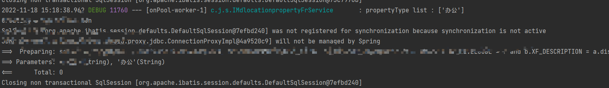

Java 开发遇到的问题以及解决方案整理。

<!-- more -->

## 一、Java

### 1. [Excel文件导出时中文被转义解决方案](https://blog.csdn.net/qq_28869233/article/details/87979552?spm=1035.2023.3001.6557&utm_medium=distribute.pc_relevant_bbs_down.none-task-blog-2~default~OPENSEARCH~default-6.nonecase&depth_1-utm_source=distribute.pc_relevant_bbs_down.none-task-blog-2~default~OPENSEARCH~default-6.nonecase)

详细原理了解：http://www.iefans.net/xiazai-wenjian-http-bianma-content-disposition/

```java
String fileName = URLEncode.encode(name, "UTF-8");
response.setHeader("Content-disposition", "attachment;filename="+fileName+";"+"filename*=utf-8''"+fileName);
```

> 文件的下载在响应之前要设置以 **附件（attachment）** 的形式，否则点击下载时会在浏览器打开。
> Spring MVC 默认的上传文件大小(max-request-size)最大为10M，可以在 配置文件中修改

## 二、Spring

### 1. Spring Security跨线程获取用户信息

使用 Spring Security 时，如果采用异步方法获取用户信息是获取不到的，它采用 ThreadLocal 存储，这样的话有些请求无法顺利执行，可以在 Spring Boot 启动类主方法添加：

```java
public static void main(String[] args) {
    SpringApplication.run(Application.class, args);
    // 开启本地线程共享
    SecurityContextHolder.setStrategyName(SecurityContextHolder.MODE_INHERITABLETHREADLOCAL);
    log.info("启动");
}
```

### 2. swagger

如果在项目中实现 `ResponseBodyAdvice` 接口统一封装 controller 返回的接口，访问 swagger 地址时会出现弹窗 `Unable to infer base url. This is common when using dynamic servlet registration or when the API is behind an API Gateway` 的问题。

需要在实现 `ResponseBodyAdvice` 的类注解上额外加入 `@RestControllerAdvice(basePackages = "xxx.xx.controller")` 限定需要对返回结果进行封装的范围，这样的话就不会拦截 swagger 相关资源的地址，访问就正常了。

也可以下面这样修改（浪子没有测试，具体见：https://juejin.cn/post/6921700441038258189）：

```java
@RestControllerAdvice
// @RestControllerAdvice(basePackages = "com.example.controller") // 只对此包中的类进行结果封装
public class ResultResponseHandler implements ResponseBodyAdvice {

    @Override
    public boolean supports(MethodParameter returnType, Class converterT  ype) {
        // 过滤不需要封装的结果
        if (returnType.getParameterType().isAssignableFrom(ResultResp.class)) {
            return false;
        }
        return true;
    }

    @Override
    public Object beforeBodyWrite(Object body, MethodParameter returnType, MediaType selectedContentType, Class selectedConverterType, ServerHttpRequest request, ServerHttpResponse response) {
         if (body instanceof Json || body instanceof UiConfiguration || 
         (body instanceof ArrayList && ((ArrayList) body).get(0) instanceof SwaggerResource)) {
            return body;
         }
        return ResultResp.success(body);
    }
```

### 3. 跨域



<!-- tab 注解方式 -->

// 注解用在 Controller 类中，该类所有方法允许其它域中进行访问
@CrossOrigin
public class xxxController {

}

<!-- tab 全局配置 -->

@Configuration
public class CorsConfig {
    @Bean
    public CorsFilter corsFilter() {
        UrlBasedCorsConfigurationSource source = new UrlBasedCorsConfigurationSource();
        CorsConfiguration config = new CorsConfiguration();
        config.setAllowedOrigins("*");
        config.setAllowedHeaders("*");
        config.setAllowedMethods("*");
        // 处理所有请求的跨域配置
        source.registerCorsConfiguration("/**", config);
        return new CorsFilter(source);
    }
}

<!-- tab MVC全局配置 -->

@Configuration
public class WebMvcConfig implements WebMvcConfigurer {
    /**
     * 跨域访问（CORS）
     *
     * @param registry
     */
    @Override
    public void addCorsMappings(CorsRegistry registry) {
        registry.addMapping("/**")
                .allowCredentials(false)
                // 所有头
                .allowedHeaders("/**")
                // 所有源
                .allowedOrigins("/**")
                // 所有方法
                .allowedMethods("/**")
                .maxAge(5000);
    }
}




## 三、MyBatis/MyBatis Plus（MP）





在 SQL 文件中使用了 `resultType="java.util.map"`，并且不止一处使用，那么凡是使用 `resultType` 或者 `resultMap` 这种属性的标签，不能有属性指向错误，否则就会报错： “Result Maps collection does not contain value for ……”





不能在 mybatis 的 `sql.xml` 中的 sql 标签（`<select>、<update>、<delete>等`）中注释 sql 语句，如果注释的语句中 ，那么就会报这个错误。如果有必须注释的语句，把相关语句复制一份放在 mybatis 标签外面使用`<!-- 注释 sql 内容 -->` 注释。如果可以，还是把 SQL 语句存储在外部的 txt 等文本文件里。



### 1. $ And \#

这个我想很多人都知道使用哪个比较好了，说说问题。具体语句省略，请注意循环内的条件。

```xml
select * from user u
left join address a on u.address = a.site
where a.longitude = #{longitude} and a.latitude = #{latitude}
<if test="mallId != null and mallId != ''">
    and u.mallId = #{mallId}
</if>
<if test="propertyType != null and propertyType.size() > 0">
    and u.property_type in
    <foreach collection="propertyType" index="index" item="type" open="(" separator="," close=")">
        ${type}
    </foreach>
</if>
```

上面的语句在循环中使用了 `${}`，我把它修改成了 `#{}`，但是输入的筛选的条件是不会生效的，继而没有返回数据。



之后看了看它传的参数，发现接口接收的字符串，然后在业务层转为字符串集合，并且为每个元素加入单引号后传入 SQL 的。


于是猜想可能就是这个原因导致查询条件不生效，于是把这段代码改成了下面的样子：


这段代码没有给分割后的字符加入英文单引号，map 方法对每一个元素都去掉前后的空格（请结合自身业务场景确定参数是否可包含空格，浪子这里不需要），然后再次测试该接口，perfect！it is working now!

之后使用修改后的字符转集合方法代码再次使用 `${}` 去测试，发现 SQL 语句查询又不生效了。。。

于是浪子明白了：使用 `${}` 时，参数为 List 类型需要我们为每个元素手动加入单引号，使用单引号包裹才会生效；而使用 `#{}` 时，List 参数类型则不需要我们手动加入英文单引号，直接传入 List 即可。

### 2. 接口传参报错

错误信息：
```bash
No primary or default constructor found for interface java.util.List]
```

后端使用 `List<String>` 或者数组接参数收时，前端传入数组接收不到；但是可以传字符串，每个元素可以使用英文 `,` 分割。

### 3. MP插入或更新null值

当使用 Mybatis Plus 时，更新数据为 null 值时，即使数据库的字段设置为可以为 null，但是更新或插入时还是数据更新失败。这个就涉及到字段验证策略了。MP 官网也给出了 [解决办法](https://baomidou.com/pages/f84a74/#%E6%8F%92%E5%85%A5%E6%88%96%E6%9B%B4%E6%96%B0%E7%9A%84%E5%AD%97%E6%AE%B5%E6%9C%89-%E7%A9%BA%E5%AD%97%E7%AC%A6%E4%B8%B2-%E6%88%96%E8%80%85-null)
